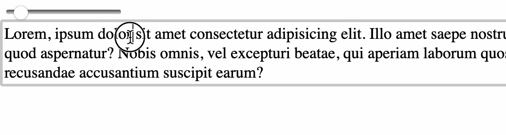

# typetestr

Simple script for change font size div content.

Add script after all div with default class .typetestr or activate by `typetester.init()` method. Script adds rage input and makes element contenteditable.

By `typetester.init()` you can specify class name and initial font size:

`init(className:string="typetestr", defaultFontSize:number=18)`